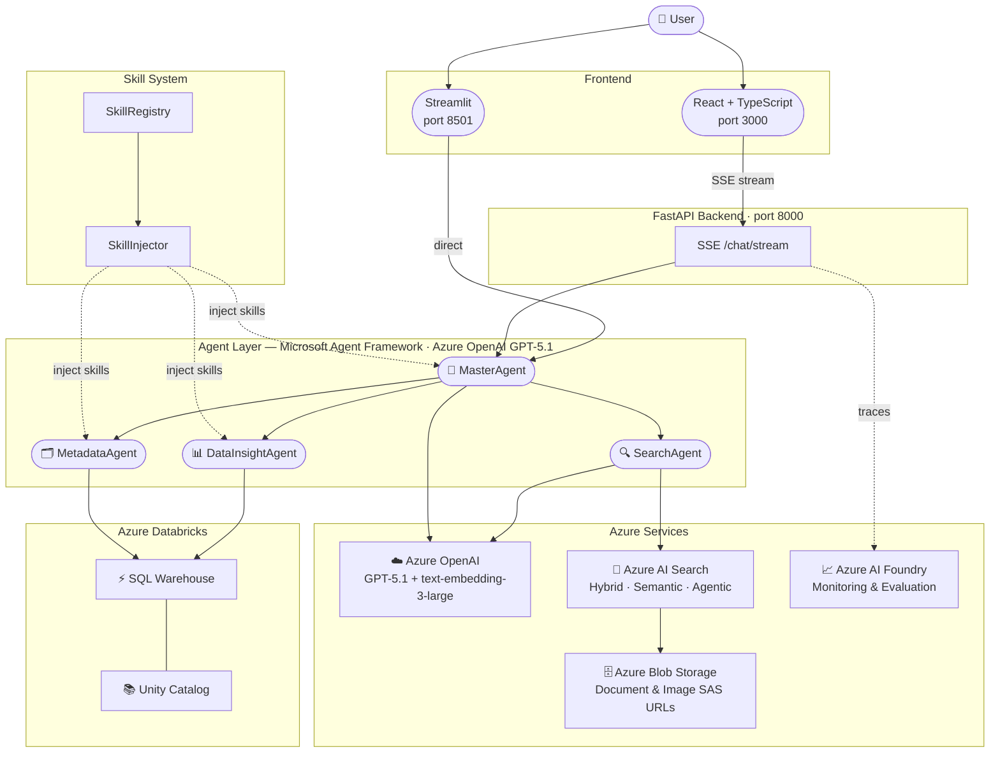

# Enterprise Data and Search Agent 

An intelligent, enterprise-grade question-answering system powered by Azure OpenAI, Azure AI Search, Microsoft Agent Framework (MAF), and Azure Databricks. Designed for automotive industry knowledge retrieval and data analytics, supporting documentation queries, and structured data analysis.

## 🌟 Features

### Core Capabilities
- **Multi-Agent Architecture**: MasterAgent orchestrates four specialized agents — SearchAgent, DataInsightAgent, MetadataAgent — each with domain-specific tools
- **Skill System**: Plugin-based skill registry (`skills/`) injects domain expertise into agent prompts at runtime; agents can call `load_skill` to retrieve full skill body on demand
- **Intelligent Query Processing**: Automatic query decomposition (`decompose_query`), multi-query parallel search (`search_multiple_queries`), and selective delegation by question type
- **Hybrid Search**: Combines vector search (text-embedding-3-large, 3072d) and keyword search (BM25) against a rich index schema
- **Semantic Reranking**: Configurable Azure AI Search semantic reranker for improved result relevance
- **Agentic Retrieval**: Optional Azure AI Search agentic retrieval mode for automated query understanding
- **Data Insight**: DataInsightAgent executes natural-language-to-SQL queries against Azure Databricks Unity Catalog
- **Metadata Browsing**: MetadataAgent lists schemas, tables, and column details from Unity Catalog
- **Multi-turn Conversations**: Context-aware dialogue with MAF in-memory thread store; each browser session gets an isolated thread
- **Streaming SSE Responses**: FastAPI backend streams `thinking`, `text`, `refs`, `done`, and `error` events to the React frontend
- **Citation Pipeline**: Search references are collected during tool calls, merged across sources, and rendered as inline footnotes with optional Blob Storage URLs

### Technology Stack
- **LLM**: Azure OpenAI GPT-5.1
- **Embedding**: text-embedding-3-large (3072 dimensions)
- **Vector Database**: Azure AI Search
- **Agent Framework**: Microsoft Agent Framework (MAF) — `AzureOpenAIChatClient`
- **Primary Frontend**: React + TypeScript (Vite, port 3000)
- **Backend API**: FastAPI with Server-Sent Events (port 8000)
- **Secondary Frontend**: Streamlit standalone app (`app.py`, port 8501) — RAG only
- **Data Analytics**: Azure Databricks Unity Catalog (SQL Warehouse via JDBC)
- **Monitoring**: Azure AI Foundry
- **Agent Skills**: Extend the agent’s capabilities using agent skills, enabling the agent to analyze and search data based on real-world business rules.
- **Sub Agents**: Adopt a multi-agent architecture, using domain-specific agents to improve efficiency and isolate context.
- **Unified Data Platform**: Enhance data consistency and data governance, facilitating the construction of an ontology in the future.

## 🏗️ Architecture



## 📁 Project Structure

```
Comprehensive_AI_Agent/
├── src/
│   ├── agents/
│   │   ├── master_agent.py      # Orchestration agent; tools: decompose_query,
│   │   │                        #   search_multiple_queries, search_knowledge,
│   │   │                        #   delegate_metadata, delegate_data_insight
│   │   ├── search_agent.py      # Azure AI Search; tools: search_knowledge_base,
│   │   │                        #   parallel_search
│   │   ├── data_insight_agent.py# Databricks SQL; tools: get_relevant_tables,
│   │   │                        #   execute_sql, load_skill
│   │   └── metadata_agent.py    # Unity Catalog schema; tools: list_schemas,
│   │                            #   list_tables, get_table_details, search_tables,
│   │                            #   load_skill
│   ├── api/
│   │   └── main.py              # FastAPI server: SSE /chat/stream + REST endpoints
│   ├── tools/
│   │   └── ai_search_tool.py    # Azure AI Search: hybrid, semantic, agentic modes
│   ├── prompts/
│   │   └── system_prompts.py    # Agent system prompts (MASTER_AGENT_PROMPT, etc.)
│   ├── config/
│   │   └── settings.py          # AzureOpenAIConfig, AzureSearchConfig,
│   │                            #   AzureAIFoundryConfig, DatabricksConfig, AppConfig
│   ├── injector.py              # SkillInjector: builds XML skill metadata for prompts
│   ├── registry.py              # SkillRegistry: scans skills/ directory at startup
│   └── utils/
│       └── logger.py            # Logging utilities
├── skills/
│   ├── analytics-spec/          # Skill: data analytics query patterns
│   │   └── SKILL.md
│   └── metadata-mapping/        # Skill: Unity Catalog metadata conventions
│       └── SKILL.md
├── frontend/                    # React + TypeScript (Vite)
│   ├── src/
│   │   ├── App.tsx              # Main chat UI + citation normalization
│   │   ├── services/api.ts      # SSE client connecting to FastAPI backend
│   │   └── types/index.ts       # TypeScript type definitions
│   ├── package.json
│   └── vite.config.ts
├── data/                        # Local data sources
├── tmp/                         # Temporary files
├── logs/                        # Application logs (application_YYYYMMDD.log)
├── app.py                       # Standalone Streamlit UI (RAG-only mode)
├── run.sh                       # Launcher: full-stack, backend, frontend, streamlit
├── requirements.txt             # Python dependencies
├── .env.example                 # Environment variables template
└── README.md                    # This file
```

## 🚀 Getting Started

### Prerequisites

- Python 3.10 or higher
- Node.js 18+ (for React frontend)
- Azure subscription with:
  - Azure OpenAI service (GPT-5.1 + text-embedding-3-large deployments)
  - Azure AI Search service (semantic search + vector search enabled)
  - Azure Blob Storage (for document and image URL resolution)
  - Azure AI Foundry project (optional, for monitoring)
  - Azure Databricks with Unity Catalog SQL Warehouse (optional, for data insight)

### Installation

```bash
# Install all Python and Node.js dependencies
./run.sh install
```

Or manually:
```bash
python3 -m venv venv && source venv/bin/activate
pip install -r requirements.txt
cd frontend && npm install && cd ..
```

### Configuration

```bash
cp .env.example .env
# Edit .env with your Azure credentials
```

Minimum required variables (see `.env.example` for full list):
```
AZURE_OPENAI_ENDPOINT
AZURE_OPENAI_AUTH_MODE      # auto | key | aad  (default: auto)
AZURE_OPENAI_API_KEY        # required when AUTH_MODE=key or auto with key set
AZURE_OPENAI_GPT_DEPLOYMENT
AZURE_SEARCH_ENDPOINT
AZURE_SEARCH_API_KEY
AZURE_SEARCH_INDEX_NAME
```

For **AAD / Entra ID** auth (when key-based auth is disabled on your Azure OpenAI resource):
```
AZURE_OPENAI_AUTH_MODE=aad
# Leave AZURE_OPENAI_API_KEY empty or remove it
# Ensure 'az login' identity has Cognitive Services OpenAI User role
```

### Running the Application

```bash
./run.sh             # Full stack: FastAPI (port 8000) + React (port 3000)
./run.sh backend     # FastAPI only
./run.sh frontend    # React dev server only
./run.sh streamlit   # Standalone Streamlit UI (port 8501, RAG only)
```

Access the React UI at `http://localhost:3000`.

## 💡 Usage

### Chat Interface (React)

1. **Ask Questions**: Type your question and press Enter or click Send
2. **New Conversation**: Click "New Chat" to start a fresh session (new MAF thread)
3. **Streaming Responses**: Answers stream token-by-token; "thinking" steps appear above the answer
4. **Citations**: Inline footnotes `[1]`, `[2]` link to source documents when a URL is available; plain-text titles are shown for internal documents without a public URL

### Question Types

| Type | Example | Routed To |
|------|---------|-----------|
| Document/standards Q&A | "乘用车国家标准的主要内容是什么？" | SearchAgent |
| English standards Q&A | "What are the recall criteria for defective automotive products?" | SearchAgent |
| Data analytics | "Show me the top 10 models by defect rate last quarter" | DataInsightAgent |
| Schema discovery | "What tables are available in the silver schema?" | MetadataAgent |

### Feature Toggles

Controlled via `.env` defaults or at runtime via the frontend:

| Flag | Default | Effect |
|------|---------|--------|
| `DEFAULT_ENABLE_SEMANTIC_RERANKER` | `true` | Azure AI Search semantic reranking |
| `DEFAULT_ENABLE_AGENTIC_RETRIEVAL` | `true` | Azure-managed agentic retrieval mode |

## ⚙️ Configuration Reference

All configuration classes are in `src/config/settings.py`:

- `AzureOpenAIConfig` — endpoint, API key, `AUTH_MODE`, API version, GPT deployment, embedding deployment and dimensions
- `AzureSearchConfig` — endpoint, API key, index name, all 30+ field name mappings, blob/image storage URLs and SAS tokens, vector profile, semantic config name
- `AzureAIFoundryConfig` — connection string for monitoring
- `DatabricksConfig` — workspace host, PAT token, SQL warehouse HTTP path, Unity Catalog name, schema list, max rows, query timeout
- `AppConfig` — log level, search result limits, feature flag defaults, directory paths

## 📊 Evaluation

Export logs from `logs/` and import into Azure AI Foundry for:
- Groundedness, relevance, coherence metrics
- A/B testing: semantic reranker on/off, agentic retrieval on/off

## 🔒 Security

- All credentials in `.env` only — never committed to version control
- `AZURE_OPENAI_AUTH_MODE=aad` forces `DefaultAzureCredential`; no API key needed at runtime
- Databricks PAT token stored in `.env`; Unity Catalog RBAC controls data access

## 📝 Logging

Logs in `logs/application_YYYYMMDD.log`:
- Agent decisions, tool calls, search queries, SQL executions, citation collection, errors

## 🔧 Troubleshooting

**403 AuthenticationTypeDisabled** — Key-based auth is disabled on your Azure OpenAI resource.
Set `AZURE_OPENAI_AUTH_MODE=aad` and ensure `az login` identity has the *Cognitive Services OpenAI User* role.

**Search returns no results** — Verify index name in `.env`, check `AZURE_SEARCH_VECTOR_FIELD=contentVector` matches your schema, confirm embedding dimensions = 3072.

**DataInsight agent not available** — `DatabricksConfig.is_configured()` returns `False`; set `DATABRICKS_HOST`, `DATABRICKS_TOKEN`, and `DATABRICKS_HTTP_PATH` in `.env`.

**Frontend cannot reach backend** — Confirm FastAPI is running on port 8000 and check CORS origins in `src/api/main.py`.

## 📄 License

This project is provided as-is for enterprise use.

## 🤝 Contributing

For questions or contributions, please contact the development team.

---

**Built with ❤️ using Azure AI, Microsoft Agent Framework, and Azure Databricks**
