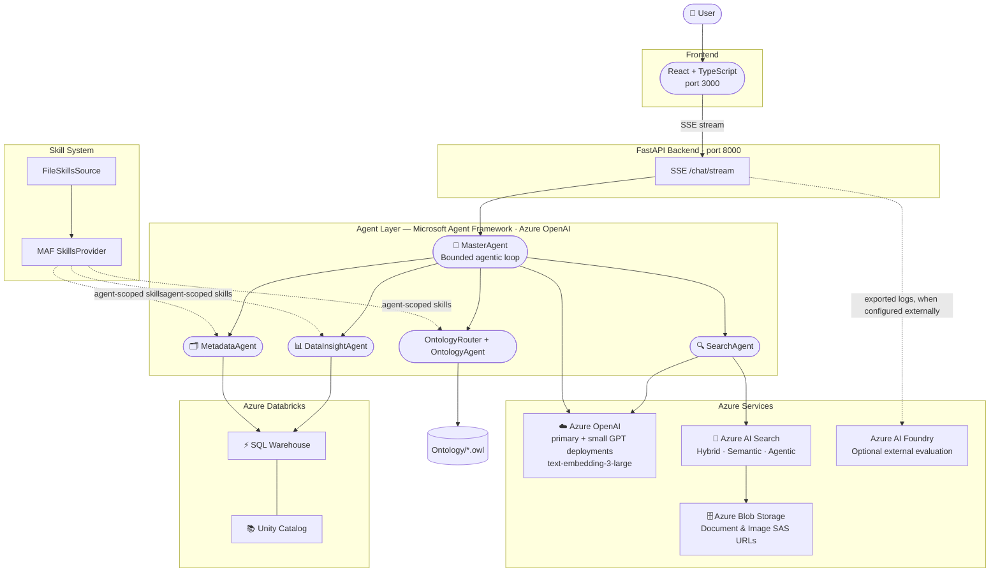

# Enterprise Data and Search Agent 

An intelligent, enterprise-grade question-answering system powered by Azure OpenAI, Azure AI Search, Microsoft Agent Framework (MAF), and Azure Databricks. Designed for automotive industry knowledge retrieval and data analytics, supporting documentation queries, and structured data analysis.

## 🌟 Features

### Core Capabilities
- **Multi-Agent Architecture**: MasterAgent orchestrates four specialized agents — SearchAgent, OntologyAgent, MetadataAgent, and DataInsightAgent — each with domain-specific tools
- **MasterAgent Agentic Loop**: One bounded MAF function loop repeats model → Agent/tool → observation until the model emits a final answer without another tool call
- **Skill System**: Native MAF `SkillsProvider` advertises agent-scoped skills and loads full instructions or indexed resources on demand
- **Intelligent Query Processing**: Query correction and enrichment, automatic decomposition (`decompose_query`), multi-query parallel search (`search_multiple_queries`), aggregation, and selective delegation by question type
- **Hybrid Search**: Combines vector search (text-embedding-3-large, 3072d) and keyword search (BM25) against a rich index schema
- **Semantic Reranking**: Configurable Azure AI Search semantic reranker for improved result relevance
- **Agentic Retrieval**: Optional Azure AI Search agentic retrieval mode for automated query understanding
- **Data Insight**: DataInsightAgent executes read-only natural-language-to-SQL queries against an Azure Databricks SQL Warehouse
- **Metadata Browsing and Recall**: MetadataAgent uses Unity Catalog table summaries for deterministic candidate recall, batch-fetches candidate details, and retains UC tools for model-driven gap recovery
- **Skill- and Ontology-Guided Analytics**: OntologyRouter checks governed Skills; ordinary enabled requests use deterministic, question-driven OWL evidence, UC physical verification, and a dynamically loaded planning Skill so the primary model derives SQL at runtime
- **Session-Scoped Ontology Mode**: Each chat session independently enables or disables ontology enrichment; failures are shown in the thinking panel and fall back to the standard metadata-driven workflow
- **User-Authored Business Layer**: Business users edit a workspace semantic document in the UI (terminology, metric definitions, reporting rules); it is stored under `data/`, injected into every analytical request, takes effect without a restart, and complements the OWL ontology in both ontology modes
- **Multi-turn Conversations**: Context-aware dialogue with MAF in-memory thread store; each browser session gets an isolated thread
- **Concurrent Sessions**: Each thread has independent messages, loading state, MAF history, cancellation, and can run alongside other threads
- **Stop & Session Cache**: Stop cancels only the active thread; exact repeated questions can reuse a completed answer from the same session without external calls
- **Streaming SSE Responses**: FastAPI streams `thinking`, `text`, `answer_reset`, `thinking_done`, `stopped`, `done`, and `error`; normalized citations are included in final `done.content`
- **Citation Pipeline**: Search references are collected during tool calls, merged across sources, and rendered as inline footnotes with optional Blob Storage URLs

### Technology Stack
- **LLM routing**: Primary Azure OpenAI deployment for Master, Search, Ontology routing/recovery, and DataInsight; `AZURE_OPENAI_GPT_SMALL_DEPLOYMENT` for Metadata discovery/verification
- **Embedding**: text-embedding-3-large (3072 dimensions)
- **Vector Database**: Azure AI Search
- **Agent Framework**: Microsoft Agent Framework 1.11 — `OpenAIChatCompletionClient`
- **Primary Frontend**: React + TypeScript (Vite, port 3000)
- **Backend API**: FastAPI with Server-Sent Events (port 8000)
- **Data Analytics**: Azure Databricks Unity Catalog plus SQL Warehouse through the Databricks SQL connector
- **Ontology Runtime**: Owlready2 with read-only recursive OWL loading; optional HermiT reasoning is disabled by default
- **Observability**: Structured activity streaming and rotating application logs, suitable for external evaluation pipelines
- **Agent Skills**: Extend the agent’s capabilities using agent skills, enabling the agent to analyze and search data based on real-world business rules.
- **Sub Agents**: Adopt a multi-agent architecture, using domain-specific agents to improve efficiency and isolate context.
- **Unified Data Platform**: Combines verified physical metadata with an existing OWL business ontology while preserving their separate authority boundaries.

## 🏗️ Architecture


```mermaid
flowchart TD
    User(["👤 User"])

    subgraph UI["Frontend"]
        direction LR
        React(["React + TypeScript\nport 3000"])
    end

    subgraph Backend["FastAPI Backend · port 8000"]
        API["SSE /chat/stream"]
    end

    subgraph Skills["Skill System"]
        direction LR
        SP["MAF SkillsProvider"]
        FS["FileSkillsSource"]
        FS --> SP
    end

    subgraph AgentLayer["Agent Layer — Microsoft Agent Framework · Azure OpenAI"]
        MA(["🧠 MasterAgent\nBounded agentic loop"])
        SA(["🔍 SearchAgent"])
        OA(["OntologyRouter + OntologyAgent"])
        DIA(["📊 DataInsightAgent"])
        META(["🗂️ MetadataAgent"])
        MA --> SA & OA & DIA & META
    end

    subgraph AzureServices["Azure Services"]
        AOAI["☁️ Azure OpenAI\nprimary + small GPT deployments\ntext-embedding-3-large"]
        AIS["🔎 Azure AI Search\nHybrid · Semantic · Agentic"]
        Blob["🗄️ Azure Blob Storage\nDocument & Image SAS URLs"]
        AIF["Azure AI Foundry\nOptional external evaluation"]
    end

    subgraph Databricks["Azure Databricks"]
        SQLW["⚡ SQL Warehouse"]
        UC["📚 Unity Catalog"]
        SQLW --- UC
    end

    User --> React
    React -->|SSE stream| API
    API --> MA

    SP -.->|agent-scoped skills| OA & DIA & META

    SA --> AIS & AOAI
    OA --> OWL[("Ontology/*.owl")]
    AIS --> Blob
    DIA --> SQLW
    META --> SQLW
    MA --> AOAI
    API -.->|exported logs, when configured externally| AIF
```

## 📁 Project Structure

```
Comprehensive_AI_Agent/
├── src/
│   ├── agents/
│   │   ├── master_agent.py      # Orchestration agent; tools: decompose_query,
│   │   │                        #   search_multiple_queries, search_knowledge,
│   │   │                        #   delegate_metadata, delegate_data_analysis
│   │   ├── search_agent.py      # Azure AI Search; tools: search_knowledge_base,
│   │   │                        #   parallel_search
│   │   ├── data_insight_agent.py# Databricks SQL; execute_sql + bounded
│   │   │                        #   context recovery; governed + dynamic planning Skills
│   │   ├── metadata_agent.py    # Unity Catalog schema; tools: list_schemas,
│   │                            #   list_tables, get_table_details, search_tables;
│   │                            #   native Skill: metadata-mapping
│   │   ├── ontology_agent.py    # Owlready2 semantic entity/property/path tools
│   │   └── maf_runtime.py       # MAF 1.11 client/session/stream adapter
│   ├── ontology/
│   │   └── service.py            # Read-only OWL loading, indexing, and graph queries
│   ├── metadata_catalog.py       # Unity Catalog SDK access, object cache,
│   │                            #   candidate detail batch fetch, SQL identifier checks
│   ├── query_engine.py          # Request-scoped MasterAgent observations,
│   │                            #   search attempts, and streaming context
│   ├── api/
│   │   └── main.py              # FastAPI server: SSE /chat/stream + REST endpoints
│   ├── tools/
│   │   └── ai_search_tool.py    # Azure AI Search: hybrid, semantic, agentic modes
│   ├── prompts/                 # Per-agent system prompts:
│   │   └── master.py · search.py · ontology.py · data_insight.py · metadata.py
│   ├── config/
│   │   └── settings.py          # AzureOpenAIConfig, AzureSearchConfig,
│   │                            #   AzureAIFoundryConfig, DatabricksConfig, AppConfig
│   ├── skills_provider.py       # Agent-scoped native MAF SkillsProvider factory
│   ├── business_layer.py        # Workspace business semantic document store (data/)
│   └── utils/
│       └── logger.py            # Logging utilities
├── skills/
│   ├── analytics-spec/          # Skill: data analytics query patterns
│   │   ├── SKILL.md             # Intent routing + resource index
│   │   └── references/
│   │       └── highest-spending-customer.sql
│   ├── sql-planning/   # Skill: dynamic OWL + UC SQL planning method
│   │   └── SKILL.md
│   └── metadata-mapping/        # Skill: Unity Catalog metadata conventions
│       └── SKILL.md
├── Ontology/
│   └── aw_ontology.owl          # Read-only business ontology and defined classes
├── frontend/                    # React + TypeScript (Vite)
│   ├── src/
│   │   ├── App.tsx              # Main chat UI + citation normalization
│   │   ├── services/api.ts      # SSE client connecting to FastAPI backend
│   │   ├── types.ts             # Chat/session/runtime TypeScript definitions
│   │   └── types/activity.ts    # Activity stream definitions
│   ├── package.json
│   └── vite.config.ts
├── data/                        # Local data sources (incl. business_layer.md, git-ignored)
├── tmp/                         # Temporary files
├── logs/                        # Application logs (application_YYYYMMDD.log)
├── run.sh                       # Launcher: full-stack, backend, frontend
├── stop.sh                      # Stops locally launched backend/frontend processes
├── requirements.txt             # Python dependencies
├── .env.example                 # Environment variables template
└── README.md                    # This file
```

## 🚀 Getting Started

### Prerequisites

- Python 3.10 or higher
- Node.js 18.18+ (for React frontend tooling)
- Java 11+ only when `ONTOLOGY_ENABLE_REASONER=true`; explicit OWL queries do not require startup reasoning
- Azure subscription with:
    - Azure OpenAI service with primary GPT, small GPT, and text-embedding-3-large deployments
    - Azure AI Search service (semantic search + vector search enabled)
    - Azure Blob Storage (for document and image URL resolution)
    - Azure AI Foundry project only if logs are exported to an external evaluation workflow
  - Azure Databricks with Unity Catalog SQL Warehouse (optional, for data insight)

### Installation

```bash
# Install all Python and Node.js dependencies
./run.sh install
```

Or manually:
```bash
python3 -m venv venv && source venv/bin/activate
pip install -r requirements.txt
cd frontend && npm install && cd ..
```

### Configuration

```bash
cp .env.example .env
# Edit .env with your Azure credentials
```

Minimum required variables (see `.env.example` for full list):
```
AZURE_OPENAI_ENDPOINT
AZURE_OPENAI_AUTH_MODE      # auto | key | aad  (default: auto)
AZURE_OPENAI_API_KEY        # required when AUTH_MODE=key or auto with key set
AZURE_OPENAI_GPT_DEPLOYMENT
AZURE_SEARCH_ENDPOINT
AZURE_SEARCH_API_KEY
AZURE_SEARCH_INDEX_NAME
```

For **AAD / Entra ID** auth (when key-based auth is disabled on your Azure OpenAI resource):
```
AZURE_OPENAI_AUTH_MODE=aad
# Leave AZURE_OPENAI_API_KEY empty or remove it
# Ensure 'az login' identity has Cognitive Services OpenAI User role
```

### Running the Application

```bash
./run.sh             # Full stack: FastAPI (port 8000) + React (port 3000)
./run.sh backend     # FastAPI only
./run.sh frontend    # React dev server only
./stop.sh            # Stop locally launched backend/frontend processes
```

Access the React UI at `http://localhost:3000`.

## 💡 Usage

### Chat Interface (React)

1. **Ask Questions**: Type your question and press Enter or click Send
2. **New Conversation**: Click "New Session" to start a fresh MAF session
3. **Streaming Responses**: Answers stream token-by-token; "thinking" steps appear above the answer
4. **Citations**: Inline footnotes `[1]`, `[2]` link to source documents when a URL is available; plain-text titles are shown for internal documents without a public URL
5. **Ontology mode**: Use the sidebar switch to enable ontology enrichment for the current session only
6. **Business Layer Doc**: Click the button in the chat header to edit the workspace semantic document (terminology, metric definitions, reporting conventions). It is shared by every session and applies from your next question — no restart required. Prefer recording what the OWL ontology does *not* already define, and note that verified Databricks schema always takes precedence.

### Question Types

| Type | Example | Routed To |
|------|---------|-----------|
| Document/standards Q&A | "乘用车国家标准的主要内容是什么？" | SearchAgent |
| English standards Q&A | "What are the recall criteria for defective automotive products?" | SearchAgent |
| Data analytics | "按地区比较订单数、销量、销售额和平均客单价" | Data analysis pipeline |
| Schema discovery | "What tables are available in the silver schema?" | MetadataAgent |

### Feature Toggles

Search flags are read from `.env` at backend startup. Ontology is initialized from `.env` and then controlled per frontend session:

| Flag | Default | Effect |
|------|---------|--------|
| `DEFAULT_ENABLE_SEMANTIC_RERANKER` | `true` | Azure AI Search semantic reranking after restart |
| `DEFAULT_ENABLE_AGENTIC_RETRIEVAL` | `true` | Azure-managed agentic retrieval mode after restart |
| `DEFAULT_ENABLE_ONTOLOGY` | `true` | Initial Ontology switch value for each new chat session |

With Ontology enabled, analytical questions start in `OntologyRouter` on the primary deployment. A confirmed governed template match skips Owlready2 and MetadataAgent, then DataInsightAgent loads the named Skill and indexed resource. Otherwise code calls the question-driven OWL composite lookup and defined-class lookup directly; only weak results escalate to the full OntologyAgent tool loop. Metadata then recalls and batch-fetches UC candidates before its small-model verification turn, and DataInsightAgent loads `sql-planning` to choose analytical roles, grain, comparisons, and SQL.

With Ontology disabled or unavailable, analytical questions run `MetadataAgent (progressively loads metadata-mapping) → DataInsightAgent`. Every non-governed DataInsight request loads `sql-planning`; without Ontology it applies the same dynamic method using the original question and verified metadata only, without inventing semantic evidence. MasterAgent, SearchAgent, OntologyRouter/OntologyAgent, and DataInsightAgent use the primary GPT deployment; both Metadata modes use `AZURE_OPENAI_GPT_SMALL_DEPLOYMENT`.

## ⚙️ Configuration Reference

All configuration classes are in `src/config/settings.py`:

- `AzureOpenAIConfig` — endpoint, API key, `AUTH_MODE`, API version, GPT deployment, embedding deployment and dimensions
- `AzureSearchConfig` — endpoint, API key, index name, all 30+ field name mappings, blob/image storage URLs and SAS tokens, vector profile, semantic config name
- `AzureAIFoundryConfig` — optional connection-string placeholder for deployment-specific integrations
- `DatabricksConfig` — workspace host, token, SQL warehouse HTTP path, Unity Catalog allowlist, query limits, metadata cache, recall index/candidate bounds, and small-schema fallback bound
- `OntologyConfig` — OWL directory/glob, local-only loading, optional reasoner, query limits, fuzzy threshold, escalation confidence, and agent timeout
- `AppConfig` — log level, search result limits, feature flag defaults, directory paths

## 📊 Evaluation

The application does not currently register an Azure AI Foundry or Application Insights exporter. Export logs from `logs/` into your evaluation system for:
- Groundedness, relevance, coherence metrics
- A/B testing: semantic reranker on/off, agentic retrieval on/off

## ✅ Validation

```bash
ONTOLOGY_ENABLE_REASONER=false venv/bin/python -m pytest test_script -q \
    --ignore=test_script/test_search.py -p no:cacheprovider
npm --prefix frontend run lint
npm --prefix frontend run build
venv/bin/python -m pip check
npm --prefix frontend audit
```

`test_search.py` requires live Azure AI Search and is excluded from the deterministic PR suite.


## 📝 Logging

Logs in `logs/application_YYYYMMDD.log`:
- Agent decisions, tool calls, search queries, SQL executions, citation collection, errors


## 📄 License

This project is provided as-is for enterprise use.

## 🤝 Contributing

For questions or contributions, please contact the development team.

---

**Built with ❤️ using Azure AI, Microsoft Agent Framework, and Azure Databricks**
