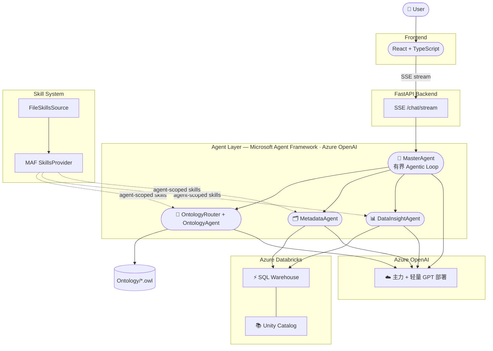

# 博客大纲：用 OWL Ontology 驱动的数据分析智能体（Ontology-Grounded Data Agent）

> 范围说明：本大纲只覆盖数据分析查询链路（OntologyAgent、MetadataAgent、DataInsightAgent 及其编排），不涉及 SearchAgent/知识检索。内容只描述当前最终架构与设计取舍的理由，不叙述中间失败方案的过程。
> 状态：初稿，待补充。

---

## 1. 引言：为什么要给 Text-to-SQL 加一层 Ontology

> 「为什么需要 Ontology」在前序文章中已有详细论证，这里只做简要回顾，重点留给本文的"如何设计、如何落地"。

- 企业数据分析场景下，用户的业务语言（"高价值订单""客户消费"）与物理表列名（`TotalDue`、`OrderQty`）之间存在天然落差；只喂物理 schema 或维护一张手写映射表，都难以兼顾语义深度和长期可维护性。
- 本文的落脚点：一个基于 OWL 的语义层如何与数据分析智能体（物理验证层 + SQL 生成执行层）分工协作，在不牺牲物理准确性的前提下，让生成 SQL 前的上下文具备业务深度。
- 后续章节将逐层拆解：架构如何分层、每层的职责边界、关键机制的实现细节，以及可直接复用的设计原则。

---

## 2. 背景知识速览（面向不熟悉 OWL 的读者）

### 2.1 什么是 Ontology / OWL（简述）
- Class / Individual、DatatypeProperty / ObjectProperty、domain/range、equivalentClass 等核心概念，前序文章已详细展开，这里不再重复。
- 本文只强调一点：OWL 把"类、属性、关系、派生业务定义"表达成可被程序检索的结构化图谱，而不是一份只给人读的文档。

### 2.2 什么是"推理"（Reasoning）与 HermiT

在继续讲技术选型之前，先解释一个后文会反复出现的概念：**推理（Reasoning）**。

- OWL 文件里显式写出来的事实只是"冰山一角"。比如你显式声明了"`MountainBike` 是 `Bikes` 的子类"，又声明了"某个体是 `MountainBike`"——但你**没有**显式声明"这个个体也是 `Bikes`"。这个事实是隐含的，人一眼能看出来，但程序默认只认显式三元组，看不出来。
- **推理器（Reasoner）**就是根据 OWL 公理（子类传递性、等价类、属性特征如传递性/逆属性、Restriction 约束等），自动把这些隐含事实计算出来的程序。这个过程叫**推理（Reasoning）**，计算出的隐含事实可以被"物化"（materialize，即显式写出来供后续直接查询）。
- **HermiT** 是一个遵循 OWL 2 DL 标准、基于 hypertableau 算法的开源推理器，本项目通过 Owlready2 直接调用它。它能做的事包括：检查本体本身有没有逻辑矛盾（一致性检查）、计算完整的类层级（包括没有显式声明的子类/父类关系）、推导个体的完整类型集合。
- **推理不是必需品，而是增强项**：本项目的查询工具（第 4 章）大多数情况靠显式的类层级遍历、属性 domain/range、equivalentClass 定义就能满足业务语义检索的需要；推理器在需要"计算隐含关系"时提供额外能力，但如果本体里用到的数据类型超出 HermiT 支持的 OWL 2 Datatype Map 范围，推理这一步可以关闭，不影响显式图查询能力（实体、属性、关系、路径查询照常可用）。

### 2.3 为什么选择 Owlready2，而不是图数据库或 SPARQL

这是一个容易被追问的技术选型，值得展开讲清楚。

**候选方案对比**

- **方案 A：把 OWL 导入图数据库（如 Neo4j）。** 图数据库擅长"节点+边"的存储与遍历，但 OWL 的价值不只是图结构，还包括 TBox（类、属性、限制、equivalentClass 等本体公理）与上一节描述的 Reasoner 推理机制之间的语义耦合。把 OWL 拍平成普通图数据库的节点边，会丢失 domain/range 约束、等价类推断、属性继承这些"公理"层面的语义——图数据库能回答"A 和 B 之间有没有边"，但不天然知道"这条边在本体语义上意味着什么、能不能被推理展开"。
- **方案 B：把 OWL 模拟成关系数据库表。** 等于重新发明一套 schema 去描述 schema 本身，而且每次本体演进（加类、加属性、改层级）都要同步改这套"元 schema"和对应的 ORM 逻辑，维护成本随本体复杂度线性甚至超线性增长。
- **方案 C：通过 SPARQL 查询端点/API 访问 OWL。** SPARQL 是标准的图模式匹配语言，但它默认只匹配**显式存在的三元组**，不会自动应用类层级、等价类、属性特征这些"公理"层面的推断——除非先运行上一节说的 Reasoner 把隐含事实**物化**成显式三元组。也就是说，如果一个个体只被显式标注为子类（如 `MountainBike`），一条精确的 `?p a :Bikes` 查询在没有先做推理的情况下会**静默漏掉**这个个体，即使它在语义上确实属于 `Bikes`——查询语法没错，但结果不完整，而调用方（无论是人还是 LLM）很难在写查询的那一刻就意识到这个隐藏前提缺失。让 LLM 驱动的 Agent 直接拼 SPARQL，等于要求它同时精通图查询语法**和**本体推理的物化时机，这个要求过高，也容易生成语法正确、语义却不完整的查询。更适合的交互形态是一组"语义明确、参数化"的高层函数工具（如 `find_paths`、`get_business_context`），把"要不要考虑子类/推理结果"这类决策封装进工具实现内部，而不是交给调用方自己判断。

**选择 Owlready2 的实际优势**

- 纯 Python 原生对象化访问 OWL（类、实例、属性都是 Python 对象），无需额外部署图数据库、SPARQL 端点或 Java/Jena 网关，部署形态最简单。
- 内建 HermiT 对接（上一节已详细介绍），需要推理时可以直接调用，不需要额外集成独立的推理引擎。
- 每一种查询能力（找实体、展开邻居、找路径……）可以直接封装成一个边界清晰、参数明确的函数，天然契合 Microsoft Agent Framework 的工具调用（function calling）模型——这比让 LLM 自己生成 SPARQL 或图查询语言更可控，也更容易做输入校验和错误处理。
- 工具函数内部可以自行决定何时需要沿类层级向上/向下遍历（父类/子类），把上面提到的"子类漏掉"问题吸收在实现内部，调用方（LLM）不需要自己知道这个陷阱并手写传递路径表达式。
- 保持 OWL 原始文件形态（只读加载），本体本身的维护、版本管理、评审都可以用标准文本工具完成，不需要额外的数据库迁移脚本。

**图数据库与 Ontology 到底是什么关系**

- 图数据库是一种**存储与遍历模型**，回答"数据之间如何连接"；Ontology（OWL）是一种**知识表示与公理系统**，不仅描述连接，还描述"类之间的包含关系、属性的定义域/值域约束、什么条件下两个类等价、可以推导出什么隐含事实"。
- 换句话说，图数据库可以是 Ontology 的一种**底层存储候选**，但它本身不提供 TBox 推理能力；只做"存图、查图"时图数据库足够，但需要"利用公理做推断、保证概念定义一致性"时，就需要 OWL 这类具备形式语义的表示法，图数据库不能替代这一层。
- 选择 Owlready2 而不是图数据库，是为了在需要时可以直接启用 Reasoner 做隐式推断，同时不为暂时用不到的能力预先支付额外的存储/查询引擎复杂度。

### 2.4 本项目 OWL 文件里的关键约定
- 每个 `DatatypeProperty` 携带中英文 `label`、`comment`，直接对应业务人员的口语词汇。
- `domain` 精确标注该属性"声明所属"的类，即使某类继承自另一个类，也保留声明处的 domain。
- 少数属性携带单位（如 USD）等辅助描述信息。

---

## 3. 架构总览：三段式流水线

### 3.1 整体架构图

（下图只展示数据分析查询链路，不包含知识检索/SearchAgent 部分）

### 3.2 两种模式的整体流程
- **Ontology 开启**：`OntologyAgent → MetadataAgent → DataInsightAgent`
- **Ontology 关闭**：`MetadataAgent → DataInsightAgent`

### 3.3 分层设计原则：每一层只对一种"事实"负责
- **OntologyAgent**：回答"这个业务概念是什么意思、应该沿着什么关系去分析"—— 语义事实。
- **MetadataAgent**：回答"这些语义对应到哪些真实存在的物理表和列"—— 物理事实。
- **DataInsightAgent**：回答"结合以上两层证据，应该执行什么 SQL、结果说明了什么"—— 执行与解释。
- 三层证据链不可互相替代、不可互相吞并——这是贯穿全文的核心设计约束。

### 3.4 置信度阈值机制：什么时候该"相信"确定性结果
- **为什么需要它**：多数问题可以用一次确定性组合检索（见 4.4）直接得到根实体、相关属性和路径，但少数问题存在歧义（同名实体、跨领域术语、生僻表达），此时确定性检索给出的结果可能不完整或不可靠，需要一个客观信号判断"这次结果能不能直接采信"。
- **用来做什么**：置信度阈值是确定性快速路径与完整多轮工具 Agent 之间的**分流开关**——决定一次请求应该"直接使用组合检索结果"还是"升级为更全面的探索式检索"。
- **怎么实现**：
  - `get_business_context` 返回结果时会基于匹配质量（精确 IRI/名称匹配，还是模糊/多语言标签匹配、候选歧义程度等）计算一个 `confidence` 分值，并同时返回 `status`（如 `ok`/`ambiguous`/`no_match`）。
  - 编排层维护一个可配置阈值（`ONTOLOGY_ESCALATION_MIN_CONFIDENCE`）：当 `status != "ok"` 或 `confidence` 低于该阈值时触发升级，转交完整工具 Agent 做多跳探索式恢复检索；否则直接采用确定性结果。
  - 阈值可配置，意味着可以随着本体规模、标签覆盖率的变化调整"多严格才升级"，不需要改代码。

---

## 4. 深入 OntologyAgent：语义检索层怎么设计

### 4.1 设计哲学：属性优先（property-first）、角色中立（role-neutral）
- 明确**不**在 Ontology 层判断"这是度量列还是维度列"。
- 明确**不**在 Ontology 层写死聚合公式（如 `SUM(...)`）或分析口径。
- 原因：把分析判断权完全留给 DataInsightAgent 的 LLM，Ontology 只提供"有证据支撑的事实"，避免语义层和执行层职责重叠、避免固化分析逻辑导致无法应对新问题类型。

### 4.2 只读查询工具集（面向 Owlready2 的封装）
- 逐一介绍工具职责（表格形式）：
  - `search_entities`：按名称/IRI/标签/别名/业务短语检索实体
  - `describe_entity`：展开单个实体的完整描述
  - `expand_neighbors`：邻居扩展
  - `find_paths`：多跳路径查找
  - `find_related_by_type`：按类型查找相关实体
  - `get_schema_mapping`：实体到物理映射候选
  - `get_join_paths`：Join 路径建议
  - `get_lineage`：血缘关系
  - `get_semantic_candidates`：语义候选召回
  - `get_business_context`：问题驱动的复合业务上下文（核心工具，见 4.4）
  - `list_defined_classes`：枚举 equivalentClass 派生业务概念
- 强调：全部只读，不修改 OWL 文件。

### 4.3 两级 Agent 设计：完整工具 Agent + 轻量 Router Agent
- **Router Agent**：`tools=[]`，只挂 Skill Provider，唯一职责是判断问题是否命中治理好的 `analytics-spec` Skill。
- **完整工具 Agent**：注册全部 11 个查询工具，仅在需要"恢复/兜底"检索时才被调用。
- 为什么拆成两个 Agent：让"是否走治理快速通道"这个判断本身足够轻、足够快，不被完整工具集拖慢。

### 4.4 确定性组合检索（把常见问题变成代码路径，而不是模型探索）
- **机制**：Router 未命中治理 Skill 时，代码直接调用 `get_business_context` + `list_defined_classes` 两个工具并组装结果，完全绕开一次多轮"模型-工具-模型"的 LLM 循环。
- **升级条件**：置信度阈值机制（见 3.4）决定何时回落到完整工具 Agent 做多轮探索式恢复查询。
- **为什么这样做是合理的**：本体查询引擎本身的执行开销很低，真正的成本集中在 LLM 的多轮工具调用上；把"根实体 + 相关属性 + 最短路径就足够回答"的常见问题变成确定性代码路径，只把真正需要探索的歧义/长尾问题留给完整 Agent，是在不牺牲覆盖面的前提下降低常见路径开销的关键设计。

### 4.5 问题驱动的子图检索（`get_business_context` 内部机制）
- 从问题中显式提到的类 + 命中属性的 domain/range 作为检索种子，而不是对整个 Ontology 做无差别广度优先遍历。
- 从种子出发，保留所有并列的最短路径，直到配置的最大深度（`ONTOLOGY_MAX_DEPTH`），避免"盲目邻域游走"。
- 支持多语言标签匹配（中文标签的分词命中）。
- 返回结构包含证据链：匹配详情（matches）、置信度（confidence）、警告（warnings）、未解决项（unresolved）—— 这让下游和最终用户都能追溯"为什么模型认为这是对的"。

### 4.6 治理 Skill 快速通道（已知高频问题的旁路）
- `analytics-spec` Skill：针对已验证、已知答案模式的高频问题（如"哪个客户消费最高"），预置可信 SQL 模板。
- 遵循 MAF Skill 渐进式加载原则：默认只暴露 `name` + `description`，命中后才 `load_skill` 读取正文，不在编排层预注入全部 Skill 内容。
- 命中后跳过 Owlready2 查询和 MetadataAgent，直接把治理上下文交给 DataInsightAgent 执行。
- 反伪造校验：编排层会验证 Router 确实调用过 `load_skill`，防止未经验证就假冒"已命中治理路径"。
- 命中后 DataInsightAgent 执行的是已验证的治理 SQL 资源，而不是第 6.2 节描述的动态规划 Skill——两者是 DataInsightAgent 注册的两个不同 Skill，按问题是否命中模板自动分流。

---

## 5. 深入 MetadataAgent：物理验证层怎么设计

### 5.1 唯一职责：验证物理存在性，不做语义判断
- 强调边界：即使 Ontology 给出了看似合理的字段建议，Metadata 也要用 Unity Catalog 的真实信息去验证，而不是直接采信。

### 5.2 两种运行模式
- **Ontology 开启**：无 Skill 的"验证器" Agent，接收 Ontology 按 **声明 domain** 分组的 `semantic_property_groups` 和 `required_relations`，只做物理核验。
- **Ontology 关闭**：使用 `metadata-mapping` Skill 的"发现"Agent，作为纯粹的"词汇 → 物理字段"翻译适配器。
- 明确 `metadata-mapping` 的职责边界（只做词汇到字段的翻译，不复制 Ontology 的关系名、正式类定义或聚合公式）—— 这是保证"关闭 Ontology"和"开启 Ontology"两种模式效果有可衡量差异的前提。

### 5.3 表摘要索引：为什么不对每次请求做全量拉表
- **为什么需要**：候选表可能有成百上千张，若每次请求都逐一拉取每张表的完整列详情，耗时会随表数量线性增长，无法扩展到真实企业规模的 Unity Catalog。
- **怎么实现**：预先构建一份轻量的表摘要索引（表名、简要注释等低成本信息），请求到来时先在索引里打分筛出一小批候选表，只对这一小批候选表做完整详情拉取，避免为无关的绝大多数表付出查询成本。

---

## 6. 深入 DataInsightAgent：把两层证据变成 SQL

### 6.1 消费两条独立证据流而不互相坍缩
- Ontology 的语义上下文与 Metadata 的物理验证结果分别保留、分别传递，Prompt 强制要求生成/重试 SQL 前必须回顾 Ontology 提供的实体、指标、维度、过滤条件、关系路径。

### 6.2 `sql-planning` Skill：把语义证据转成可执行查询计划
- **定位**：这是一个渐进式加载的 Skill（而非写死的 Prompt 规则），DataInsightAgent 对每一个未命中治理模板（见 4.6）的分析请求，在生成 SQL 前都会加载它。它定义的是**规划方法**，不是固定的指标目录、分析公式或 SQL 模板。
- **权威边界（Authority Boundaries）**：
  - 原始用户问题决定分析目标。
  - Ontology 上下文在可用时，对业务含义（实体、属性 domain/range、标签、定义、类约束、层级、关系角色、语义路径）拥有权威解释权；不可用时不得凭空捏造语义证据。
  - Unity Catalog 元数据对物理事实（表、列、类型、键、Join 方向、基数、可用性）拥有权威解释权。
  - 任何 Ontology 实体名或候选映射，在 MetadataAgent 验证之前都**不是**可执行的 SQL 标识符。
- **动态规划流程**（Skill 内定义的六步方法，而非代码写死的分支）：
  1. 从原始问题识别分析目标，挑选真正相关的度量、维度、约束、层级、关系路径——不自动套用全部推荐因子。
  2. 依据所选度量的语义 domain 与用户请求的分组/实体，推导分析粒度；在做一对多 Join 前保持这个粒度，避免数值被重复放大。
  3. 把排好序的语义路径对照已验证的物理 Join；只在完整元数据证据确实缺表/缺列/缺 Join 时才请求一次 Metadata 恢复。
  4. 基于选定语义和已验证 schema 设计 SQL；由模型在运行时判断这个问题需要一条查询还是多条互补证据查询。
  5. 对趋势/对比/解释类问题，只有当周期、基线、拆解方式、候选维度确实由请求的指标、Ontology 关系或约束、以及可用物理数据推导得出时才选用——没有默认基线或默认拆解方式。
  6. 执行能回答问题的最小证据集合；区分"实测观察"与"解释性假设"，没有证据支撑不宣称因果关系。
- **为什么是 Skill 而不是写进固定 Prompt**：保持基础 Prompt 精简，只在真正需要"动态规划"的非治理请求时才加载这套方法；治理模板命中的请求（见 4.6）完全绕开它，直接执行已验证的 SQL 资源。`analytics-spec`（治理模板）与 `sql-planning`（动态规划）是 DataInsightAgent 注册的两个不同 Skill，分别服务于模板化请求和临时起意的分析请求两种形态。无论 Ontology 开关状态如何，只要问题未命中治理模板都会加载它；Ontology 开启时，它正是把 Ontology 语义证据当作权威依据的那一层机制。

### 6.3 SQL 生成与作用域校验
- 用 `sqlglot` 解析生成的 SQL，强制校验 catalog/schema 是否在配置的允许范围（`DATABRICKS_CATALOG` / `DATABRICKS_SCHEMAS`）之内。

### 6.4 有界恢复机制
- `recover_metadata_context` / `recover_ontology_context`：每次请求最多触发一次，避免无限重试拖慢响应,同时保证真正缺上下文时有一次补救机会。

### 6.5 结果诊断与降级说明
- 对空结果、全零、常量、两两相同等"退化结果形态"做画像识别。
- 允许一次 `purpose="diagnostic"` 的诊断性 SQL 追问,而不是直接把退化结果当作正常答案呈现。

### 6.6 SQL 标识符纠正的安全边界
- 只做精确大小写匹配或唯一后缀匹配的标识符纠正,不做模糊列名猜测。
- 对绑定在 CTE / 未核验关系上的别名,直接排除出全局正则纠正范围,防止把"投影别名"误当成"物理列名"重写。

---

## 7. 横切关注点（Cross-Cutting Concerns）

### 7.1 请求级隔离
- Ontology 开关是 Session 级别设置，不同会话互不影响。
- 响应缓存键包含 `thread_id + 归一化问题 + ontology 模式`，避免切换模式后复用另一模式的答案。

### 7.2 失败处理与可见降级
- Ontology 查询失败时，不静默切换，而是在思考面板明确说明失败原因，然后降级为 `MetadataAgent → DataInsightAgent` 的标准流程。

---

## 8. 可复用的设计原则总结（写给想自建类似系统的读者）

- 语义、物理验证、SQL 执行三件事永远分离，任何一层都不应替另一层做判断。
- 语义层保持角色中立：不预先判断度量/维度，把这类分析判断留给具备推理能力的 LLM。
- 把"常见情况"做成确定性代码路径，把 LLM 探索能力保留给真正的歧义/长尾问题。
- 治理快速通道（预置可信答案）与开放式语义推理可以共存，二者按问题类型自动分流。
- 多语言、带别名的本体标签，是连接自然语言提问和物理列名的低成本高收益手段。
- 任何辅助性词汇映射层都要有严格的职责红线，防止退化成语义层的影子副本。

---

## 9. 结语

- 回顾核心价值主张：OWL Ontology 作为自然语言与物理 schema 之间的业务语义中间层，能显著提升 SQL 生成的深度与准确性，且通过确定性快速路径可以做到不牺牲延迟。
- 展望可能的延伸方向（视实际情况补充，例如：让 OWL 数据类型与推理器兼容以启用隐式推断、扩大治理 Skill 覆盖的问题范围等）。

---

## 附录

> 待补充：GitHub 仓库地址、前序文章链接、相关参考文档等。
