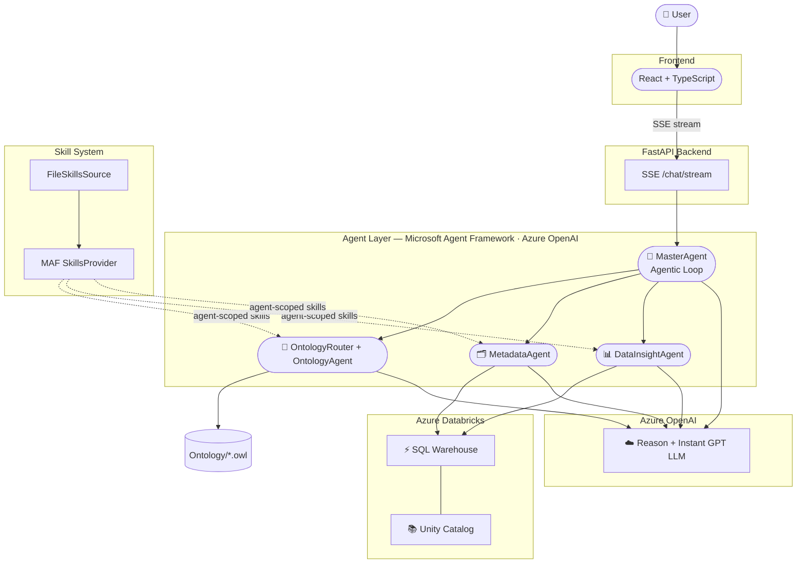
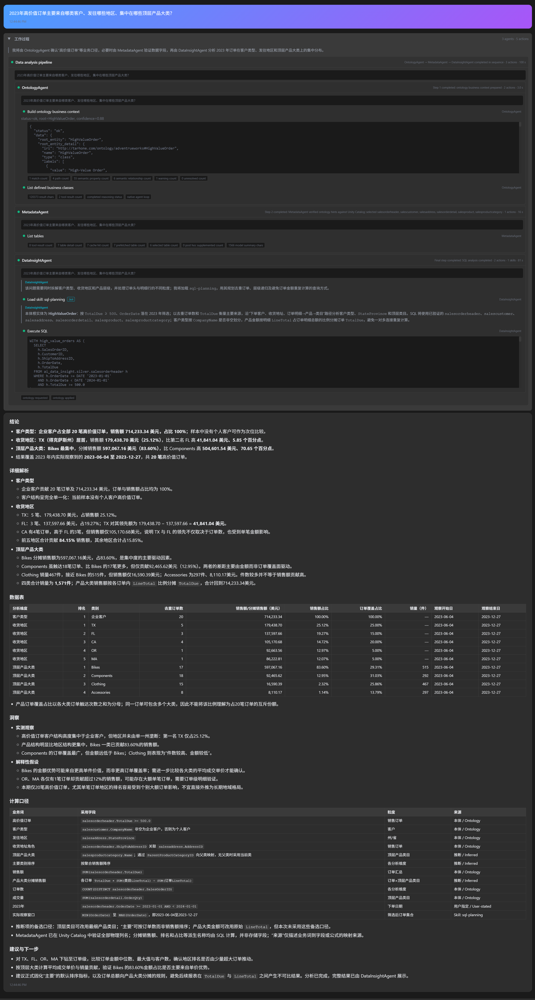
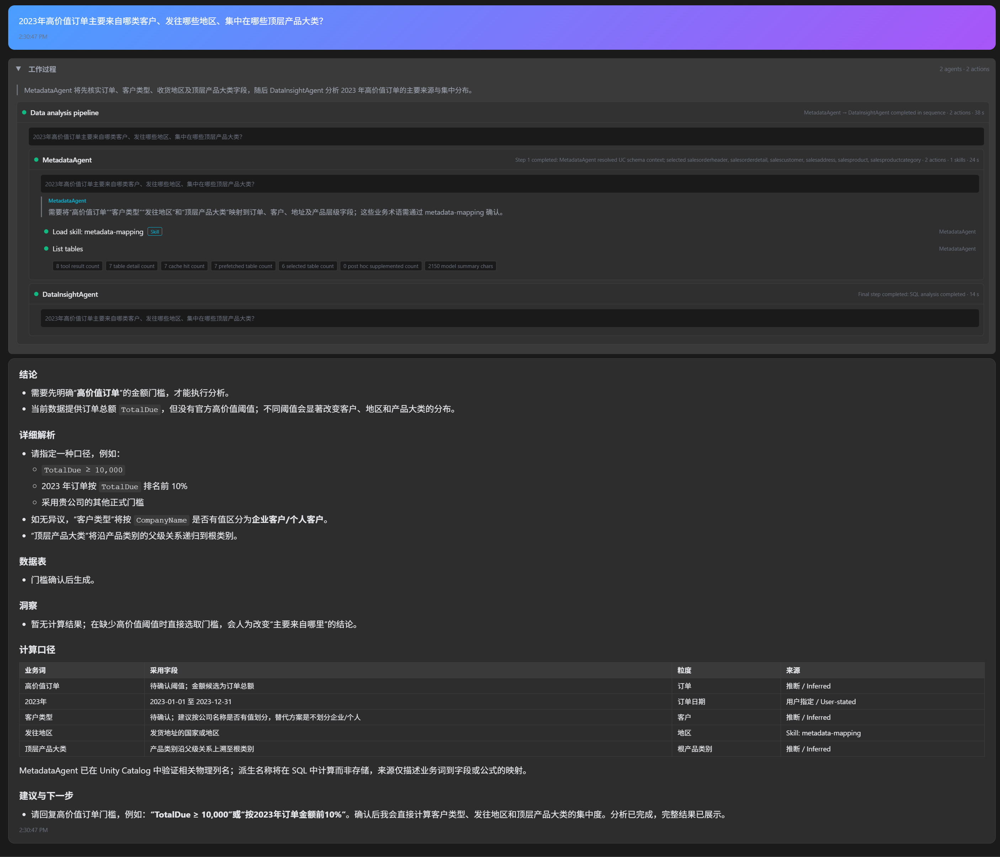

# Ontology（本体）Part 3：Ontology (OWL) 驱动的数据分析智能体实战

> 各位同学久等了。Ontology第三篇，Data Agent结合Ontology作为语义层的设计思想与实战来了。建议第一次看的同学抽出点时间阅读下面的两篇前序文章。如果您已经很熟悉 Ontology 的概念和意义可以略过。

https://mp.weixin.qq.com/s/-SznuaSqg5kq5y-LcPhFwg

https://mp.weixin.qq.com/s/KchHHsrCno22h_Hp9hZJSg

> 本文中涉及的源码请查看：


## 1. 引言：为什么要给 Data Agent (text-to-sql) 加一层 Ontology

为什么需要 Ontology 在前序文章中已有详细论证，这里只做简要回顾，重点留给本文的"如何设计、如何落地"。

企业数据分析场景下，用户的业务语言和物理表列名之间存在天然落差。用户会问"高价值订单有多少""客户消费排名"，但物理表里对应的可能是 `TotalDue`、`OrderQty` 这类缩写列名。只把物理 schema 喂给大模型，模型缺少业务含义，容易选错列或漏掉隐含的多跳关系；手写一张"业务词 → 列名"映射表，又难以表达关系、层级和正式业务定义。

本文要讲的方案：引入一个基于 OWL 的语义层，作为用户自然语言和物理 schema 之间的翻译与推理中介，让生成 SQL 前的上下文既有业务深度，又不牺牲物理准确性。我选择多个相互协作的子智能，体各司其职的设计 —— Ontology Agent 负责业务语义，Metadata Agent 负责物理表属性验证，Data Insight Agent 负责生成并执行 SQL。后面的章节会逐层拆解这套架构的设计动机、实现机制和可复用的原则。

## 2. 背景知识速览

这一章面向不熟悉 OWL 的读者，铺垫后文会反复用到的几个概念。已经熟悉 OWL 基础的读者可以直接跳到第 3 章。

### 2.1 什么是 Ontology / OWL

OWL（Web Ontology Language）是 W3C 制定的本体描述语言：本体（Ontology）是抽象概念上"一套形式化的类、属性与关系模型"，OWL 就是把这套模型写成程序可以解析、可以推理的具体文件格式的语言。

Class（类）、Individual（实例）、DatatypeProperty（数据类型属性，对应"字段"）、ObjectProperty（对象属性，对应"关系"）、domain/range（属性的定义域/值域）、equivalentClass（等价类，用来表达派生业务概念）—— 这些核心概念前序文章已经详细展开，这里不重复讲解。

本文只强调一点：OWL 把"类、属性、关系、派生业务定义"表达成一份可以被程序检索的结构化图谱，而不是一份只给人读的文档。这个"可被程序检索"的性质，是后面整套架构成立的前提。

### 2.2 什么是"推理"（Reasoning）与 HermiT

在继续讲技术选型之前，先解释一个概念：**推理（Reasoning）**。

OWL 文件里显式写出来的事实只是冰山一角。举个例子：你在本体里声明了"`MountainBike` 是 `Bikes` 的子类"，又声明了"某个体是 `MountainBike`" —— 但你**没有**显式声明"这个个体也是 `Bikes`"。这个事实是隐含的，人一眼能看出来，但程序默认只认显式三元组，看不出来。

**推理器（Reasoner）**就是根据 OWL 公理 —— 子类传递性、等价类、属性特征（如传递性、逆属性）、Restriction 约束等自动把这些隐含事实计算出来的程序。这个计算过程叫**推理（Reasoning）**，算出来的隐含事实可以被"物化"（materialize），也就是显式写出来供后续直接查询。

本项目使用的推理器是 **HermiT**，一个遵循 OWL 2 DL 标准、基于 hypertableau 算法的开源推理器，通过 Owlready2 直接调用。它能做的事情包括：

- 一致性检查——本体本身有没有逻辑矛盾
- 计算完整的类层级——包括没有显式声明的子类/父类关系
- 推导个体的完整类型集合

需要强调的是，**推理不是必需品，而是增强项**。本项目第 4 章介绍的查询工具，大多数情况下靠显式的类层级遍历、属性 domain/range、equivalentClass 定义就能满足业务语义检索的需要；推理器在需要"计算隐含关系"时提供额外能力，但如果本体里用到的数据类型超出 HermiT 支持的 OWL 2 Datatype Map 范围，推理这一步可以关闭，不影响显式图查询能力——实体、属性、关系、路径查询照常可用。另外这个推理需要区别于LLM的推理，这是OWL自带的一种能力，在大模型时代之前就存在，两者可以结合使用。

### 2.3 为什么选择 Owlready2，而不是图数据库或 SPARQL

这是一个容易迷惑的技术选型，值得展开讲清楚。

[Owlready2](https://github.com/pwin/owlready2) 是一个开源 Python 库，可以直接把 OWL 本体文件加载成 Python 对象——类、属性、个体都能像操作普通 Python 对象一样访问和查询，并内置了对 HermiT 等推理器的调用支持。

**候选方案对比**

**把 OWL 导入图数据库（如 Neo4j）。** 图数据库擅长"节点+边"的存储与遍历，但 OWL 的价值不只是图结构，还包括 TBox（类、属性、限制、equivalentClass 等本体公理）与上一节描述的 Reasoner 推理机制之间的语义耦合。把 OWL 拍平成普通图数据库的节点边，会丢失 domain/range 约束、等价类推断、属性继承这些"公理"层面的语义——图数据库能回答"A 和 B 之间有没有边"，但不天然知道"这条边在本体语义上意味着什么、能不能被推理展开"。

**把 OWL 模拟成关系数据库表。** 等于重新发明一套 schema 去描述 schema 本身，而且每次本体演进——加类、加属性、改层级——都要同步改这套"元 schema"和对应的 ORM 逻辑，维护成本随本体复杂度线性甚至超线性增长。

**通过 SPARQL 查询端点/API 访问 OWL。** SPARQL 是标准的图模式匹配语言，但它默认只匹配**显式存在的三元组**，不会自动应用类层级、等价类、属性特征这些公理层面的推断——除非先运行 Reasoner 把隐含事实物化成显式三元组。也就是说，如果一个个体只被显式标注为子类（如 `MountainBike`），一条精确的 `?p a :Bikes` 查询在没有先做推理的情况下会**静默漏掉**这个个体，即使它在语义上确实属于 `Bikes`——查询语法没错，但结果不完整，而调用方（无论是人还是 LLM）很难在写查询的那一刻就意识到这个隐藏前提缺失。让 LLM 驱动的 Agent 直接拼 SPARQL，等于要求它同时精通图查询语法**和**本体推理的物化时机，这个要求过高，也容易生成语法正确、语义却不完整的查询。

更适合的交互形态是一组"语义明确、参数化"的高层函数工具，比如 `find_paths`、`get_business_context`（需要自己设计定义这些函数，后面会详细介绍），把"要不要考虑子类/推理结果"这类决策封装进工具实现内部，而不是交给调用方自己判断。

**选择 Owlready2 的实际优势**

- 纯 Python 原生对象化访问 OWL——类、实例、属性都是 Python 对象，无需额外部署图数据库、SPARQL 端点或 Java/Jena 网关，部署形态最简单。
- 内建 HermiT 对接，需要推理时可以直接调用，不需要额外集成独立的推理引擎。
- 每一种查询能力——找实体、展开邻居、找路径——可以直接封装成一个边界清晰、参数明确的函数，天然契合 Microsoft Agent Framework/LangGraph 等框架的工具调用（function calling）模型。这比让 LLM 自己生成 SPARQL 或图查询语言更可控，也更容易做输入校验和错误处理。
- 工具函数内部可以自行决定何时需要沿类层级向上/向下遍历（父类/子类），把上面提到的"子类漏掉"问题吸收在实现内部，调用方（LLM）不需要自己知道这个陷阱并手写传递路径表达式。
- 保持 OWL 原始文件形态（只读加载），本体本身的维护、版本管理、评审都可以用标准文本工具完成（如前两篇文章阐述），不需要额外的数据库迁移脚本。

**图数据库与 Ontology 到底是什么关系**

图数据库是一种**存储与遍历模型**，回答"数据之间如何连接"；Ontology（OWL）是一种**知识表示与公理系统**，不仅描述连接，还描述"类之间的包含关系、属性的定义域/值域约束、什么条件下两个类等价、可以推导出什么隐含事实"。

换句话说，图数据库可以是 Ontology 的一种底层存储候选，但它本身不提供 TBox 推理能力；只做"存图、查图"时图数据库足够，但需要"利用公理做推断、保证概念定义一致性，提供给LLM企业商业语义等"时，就需要 OWL 这类具备形式语义的表示法，图数据库不能替代这一层。本项目选择 Owlready2 而不是图数据库，是为了在需要时可以直接启用 Reasoner 做隐式推断，同时不为暂时用不到的能力预先支付额外的存储/查询引擎复杂度。

### 2.4 本项目 OWL 文件里的关键约定

本项目的 OWL 文件遵循但不限于下面几个对下游检索至关重要的约定：

- 每个 `DatatypeProperty` 携带中英文 `label`、`comment`，直接对应业务人员的口语词汇。比如一个叫 `orderQty` 的属性，`label` 会同时给出"数量""销量"这类中文别名。
- `domain` 精确标注该属性"声明所属"的类，即使某类继承自另一个类，也保留声明处的 domain。这一点在第 5 章会看到它的实际作用——物理验证阶段需要按声明 domain 分组，而不是把继承来的属性一股脑归并到派生实体名下。
- 少数属性携带单位（如 USD）等辅助描述信息。
- 等价类的定义，涉及清晰的真实商业判断逻辑和定义。
- 自定义度量，measure, 帮助LLM理解企业中数据的计算口径和逻辑。

### 2.5 本项目技术栈总览

在进入具体架构之前，先给一份完整的技术栈清单，说明每一层实际用了什么、为什么这么选：

| 层次 | 技术选型 | 用途 |
|---|---|---|
| Agent 编排框架 | Microsoft Agent Framework（MAF） | 提供 agentic loop、工具调用（function calling）注册、渐进式加载的 Skill 系统（SkillsProvider / FileSkillsSource），是本文三个子智能体和 MasterAgent 的共同底座 |
| LLM 提供方 | Azure OpenAI | 按任务复杂度分两档部署：需要深度推理的环节用主力模型，路由判断、格式化这类轻量任务用响应更快的小模型 |
| 本体查询 | Owlready2 + HermiT | 详见 2.2、2.3——本体是只读加载的 OWL 文件，不引入图数据库或 SPARQL 端点 |
| 数据仓库 | Azure Databricks | SQL Warehouse 负责 SQL 执行，Unity Catalog （Databricks 自带的数据治理层）是物理表/列/类型/权限的唯一权威来源 |
| SQL 解析与校验 | sqlglot | 详见 6.3——对生成的 SQL 做 catalog/schema 作用域静态校验 |
| 后端服务 | FastAPI + SSE | 通过 Server-Sent Events 把 Agent 的思考过程和最终结果流式推给前端 |
| 前端 | React + TypeScript | 渲染流式思考过程与最终分析结果 |

暂时不需要引入的技术，2.3 已经详细论证过原因，这里作为清单再强调一次：**图数据库**（如 Neo4j）和**独立的 SPARQL 查询端点**都没有被使用——本体检索完全通过 Owlready2 的 Python 对象 API 完成。

## 3. 架构总览：Multi Agent 相互交互调用及Workflow.

### 3.1 Data Agent 整体架构图




MasterAgent 是唯一的编排入口，通过 Microsoft Agent Framework 的有界 agentic loop 委派给三个子智能体。每个子智能体都是独立的 MAF Agent，各自拥有自己的工具集和 Skill 挂载。关于 Data Agent 的 Harness 后面有机会另起文章详细介绍。

### 3.2 两种模式的整体流程

- **Ontology 开启**：`OntologyAgent → MetadataAgent → DataInsightAgent`
- **Ontology 关闭**：`MetadataAgent → DataInsightAgent`

Ontology 是否参与，是一个 Session 级别的开关，不影响其他并发会话。关闭时系统退化为纯粹的物理 schema 驱动分析，这也是为什么 3.3 节强调"每一层只对一种事实负责"——即使少了语义层，物理验证和 SQL 执行两层依然能独立工作。此举考虑到毕竟 Ontology 的开发和设计还是有一定的人工和资源成本的，在没有成熟的 Ontology 能力之前也可以直接使用。通过合理的 Metadata 的配置和编排，也可以达到不错的分析效果。

### 3.3 分层设计原则：每一层只对一种"事实"负责

- **OntologyAgent** 回答"这个业务概念是什么意思、应该沿着什么关系去分析"——语义事实。
- **MetadataAgent** 回答"这些语义对应到哪些真实存在的物理表和列"——物理事实。
- **DataInsightAgent** 回答"结合以上两层证据，应该执行什么 SQL、结果说明了什么"——执行与解释。

三层证据链不可互相替代、不可互相吞并。这是贯穿全文的核心设计约束：如果 Ontology 越权做物理验证，会产生它无法保证的物理表/列假设；如果 Metadata 越权做语义判断，会让"关闭 Ontology"和"开启 Ontology"两种模式的效果趋同 （Metadata 的文本语义能力本身也有限），语义层就失去了存在的意义。后面每一章的具体机制，都是在保证这条边界不被打破。

### 3.4 置信度阈值机制：什么时候该"相信"确定性结果

多数问题可以用一次确定性组合检索（见 4.4）直接得到根实体、相关属性和路径，但少数问题存在歧义——同名实体、跨领域术语、生僻表达——此时确定性检索给出的结果可能不完整或不可靠。系统需要一个客观信号来判断"这次结果能不能直接采信"。

置信度阈值就是确定性快速路径与完整多轮工具 Agent 之间的**分流开关**。它的实现方式是：

```python
@staticmethod
def needs_recovery(payload: dict[str, Any]) -> bool:
    """Return whether the composite lookup is too weak to hand off unaided."""
    if not isinstance(payload, dict) or payload.get("status") != "ok":
        return True
    try:
        confidence = float(payload.get("confidence") or 0.0)
    except (TypeError, ValueError):
        return True
    return confidence < OntologyConfig.ESCALATION_MIN_CONFIDENCE
```

`get_business_context` （见下面文章解释）返回结果时会基于匹配质量——精确 IRI/名称匹配，还是模糊/多语言标签匹配、候选歧义程度——计算一个 `confidence` 分值，并同时返回 `status`（如 `ok`/`ambiguous`/`no_match`）。编排层维护一个可配置阈值 `ONTOLOGY_ESCALATION_MIN_CONFIDENCE`（默认 `0.5`）：当 `status != "ok"` 或 `confidence` 低于该阈值时触发升级，转交完整工具 Agent 做多跳探索式恢复检索；否则直接采用确定性结果。阈值可配置，意味着可以随着本体规模、标签覆盖率的变化调整"多严格才升级"，不需要改代码。

## 4. 深入 OntologyAgent：语义检索层是如何设计的

### 4.1 设计哲学：属性优先（property-first）、角色中立（role-neutral）

OntologyAgent 明确**不**在语义层判断"这是度量列还是维度列"，也明确**不**写死聚合公式（如 `SUM(...)`）或固定分析口径。

这个克制是有意为之：把分析判断权完全留给 DataInsightAgent 的 LLM，Ontology 只提供"有证据支撑的事实"。这样做避免了两个问题——语义层和执行层职责重叠，以及把分析逻辑固化在代码或本体里导致系统无法应对新问题类型。一个属性"是不是度量"往往取决于具体问题（同一个 `orderQty` 字段，在"总销量"问题里是度量，在"按数量分组"问题里可能是维度），这种上下文相关的判断，只有具备推理能力的 LLM 才能做好。

### 4.2 只读查询工具集

OntologyAgent 面向 Owlready2 封装了一组只读查询工具，全部不修改 OWL 文件：

| 工具 | 职责 |
|---|---|
| `search_entities` | 按名称/IRI/标签/别名/业务短语检索实体 |
| `describe_entity` | 展开单个实体的完整描述 |
| `expand_neighbors` | 邻居扩展 |
| `find_paths` | 多跳路径查找 |
| `find_related_by_type` | 按类型查找相关实体 |
| `get_schema_mapping` | 实体到物理映射候选 |
| `get_join_paths` | Join 路径建议 |
| `get_lineage` | 血缘关系 |
| `get_semantic_candidates` | 语义候选召回 |
| `get_business_context` | 问题驱动的复合业务上下文（核心工具，见 4.4） |
| `list_defined_classes` | 枚举 equivalentClass 派生业务概念 |

这些工具共同构成了 OntologyAgent 的"完整能力集"，但大多数请求根本用不上完整探索——这正是下面两节要讲的两级设计。

### 4.3 两级 Agent 设计：完整工具 Agent + 轻量 Router Agent

OntologyAgent 内部实际持有两个 MAF Agent：

- **Router Agent**：`tools=[]`，只挂 Skill Provider，唯一职责是判断问题是否命中治理好的 `analytics-spec` Skill。
- **完整工具 Agent**：注册全部 11 个查询工具，仅在需要"恢复/兜底"检索时才被调用。

拆成两个 Agent 的原因很直接：我们在 Data Agent 此类产品的使用中往往会碰到需要经常查询，并且想保持一致的回答格式和非常精确SQL执行。这样不妨让用户自己自主配置想使用的固定SQL语句，然后让LLM直接执行，跳过所有的推理和生成。让"是否走治理快速通道"这个判断本身足够轻、足够快，不被完整工具集拖慢。Router 不需要理解本体的图结构，它只需要判断问题是否匹配一条已知的治理规则 (Skill中的References)。这里的开发方式会另起文章介绍。

### 4.4 确定性组合检索：把常见问题变成代码路径

Router 未命中治理 Skill 时，系统不会立刻启动一次完整的多轮"模型-工具-模型"LLM 循环，而是由代码直接调用 `get_business_context` + `list_defined_classes` 两个工具并组装结果：

```python
def collect_deterministic_context(self, question: str) -> dict[str, Any]:
    """Run the composite lookup in code and record it as if the model had called it."""
    payload = self.ontology_service.get_business_context(
        question,
        root_entity="",
        max_depth=OntologyConfig.MAX_DEPTH,
    )
    self._tool_json("get_business_context", {...}, payload)
    # Derived OWL classes are eight rows in total, so they are always cheaper to include
    # than to let the model discover them one question at a time.
    self._tool_json("list_defined_classes", {}, self.ontology_service.list_defined_classes())
    ...
    return payload
```

这次调用之后，3.4 节介绍的 `needs_recovery` 决定是否需要回落到完整工具 Agent 做多轮探索式恢复查询。

为什么这样做是合理的：本体查询引擎本身的执行开销很低，真正的成本集中在 LLM 的多轮工具调用上。把"根实体 + 相关属性 + 最短路径就足够回答"的常见问题变成确定性代码路径，只把真正需要探索的歧义/长尾问题留给完整 Agent，是在不牺牲覆盖面的前提下降低常见路径开销的关键设计。意在提高 Agent 整体的分析查询速度。

### 4.5 问题驱动的子图检索

`get_business_context` 是整套确定性检索的核心，它的检索策略不是对整个 Ontology 做无差别的广度优先遍历，而是：

1. 从问题中显式提到的类，加上命中属性的 domain/range，作为检索种子。
2. 从种子出发，保留所有并列的最短路径，直到配置的最大深度 `ONTOLOGY_MAX_DEPTH`，避免"盲目邻域游走"。
3. 支持多语言标签匹配，包括中文标签的分词命中。
4. 返回结构包含完整证据链——匹配详情（matches）、置信度（confidence）、警告（warnings）、未解决项（unresolved）。

这条证据链的意义在于可追溯性：下游 Agent 和最终用户都能看到"为什么模型认为这是对的"，而不是一个不透明的黑盒结论。

### 4.6 治理 Skill 快速通道：已知高频问题的旁路

`analytics-spec` 是一个 Skill，针对已验证、已知答案模式的高频问题（比如"哪个客户消费最高"这类反复出现的固定分析）预置了可信的 SQL 模板。它遵循 MAF Skill 的渐进式加载原则：默认只暴露 `name` + `description`，命中后才 `load_skill` 读取正文，不会在编排层预先把所有 Skill 内容都注入进去。

命中后，请求会直接跳过 Owlready2 查询和 MetadataAgent，把治理上下文交给 DataInsightAgent 执行。编排层还有一层反伪造校验：会验证 Router 确实调用过 `load_skill`，防止未经验证就假冒"已命中治理路径"。

需要注意的是，命中治理路径后 DataInsightAgent 执行的是已验证的治理 SQL 资源，而不是 6.2 节要讲的动态规划 Skill——`analytics-spec` 和 `sql-planning` 是 DataInsightAgent 注册的两个不同 Skill，按问题是否命中模板自动分流，互不冲突。

## 5. 深入 MetadataAgent：物理验证层怎么设计

### 5.1 唯一职责：验证物理存在性，不做语义判断

MetadataAgent 的边界很明确：即使 Ontology 给出了看似合理的字段建议，Metadata 也要用 Unity Catalog 的真实信息去验证，而不是直接采信。它回答的永远是"这个东西真的存在吗、叫什么名字、类型是什么"，而不是"这个东西的业务含义是什么"。

### 5.2 两种运行模式

MetadataAgent 内部同样区分两套行为：

- **Ontology 开启**：使用一个不挂任何 Skill 的"验证器"Agent（`MetadataVerifierAgent`，`enable_skills=False`），接收 Ontology 按**声明 domain** 分组的 `semantic_property_groups` 和 `required_relations`，只做物理核验。这里的"按声明 domain 分组"不是随口一提——本体里一个属性的 `entity` 字段可能是一个派生概念（比如某个 equivalentClass），但它的**声明 domain** 才是它真正归属的物理实体。代码在构建验证请求时明确优先使用声明 domain，只有在 domain 为空时才退回到 `entity` 字段，这样才能保证物理验证阶段不会因为归属混淆而验证错对象。
- **Ontology 关闭**：使用带 `metadata-mapping` Skill 的"发现"Agent，作为纯粹的"词汇 → 物理字段"翻译适配器。

`metadata-mapping` 的职责边界被严格限制：只做词汇到字段的翻译，不复制 Ontology 的关系名、正式类定义或聚合公式。

### 5.3 表摘要索引：为什么不对每次请求做全量拉表

候选表可能有成百上千张，若每次请求都逐一拉取每张表的完整列详情，耗时会随表数量线性增长，无法扩展到真实企业规模的 Unity Catalog。

实现方式是预先构建一份轻量的表摘要索引——表名、简要注释等低成本信息（受 `METADATA_INDEX_MAX_TABLES` 限制，默认最多索引 500 张表）。请求到来时，先在索引里打分筛出一小批候选表（`METADATA_CANDIDATE_MAX_TABLES`，默认 12 张），只对这一小批候选表做完整详情拉取，避免为无关的绝大多数表付出查询成本。

## 6. 深入 DataInsightAgent：把两层证据变成 SQL

### 6.1 消费两条独立证据流而不互相坍缩

DataInsightAgent 同时接收 Ontology 的语义上下文和 Metadata 的物理验证结果，两者分别保留、分别传递，不会被合并成一份含糊的综合材料。它的 Prompt 强制要求：生成或重试 SQL 前必须回顾 Ontology 提供的实体、指标、维度、过滤条件、关系路径——这保证了即使物理证据已经充分，语义层的分析意图也不会被丢在一边。

### 6.2 `sql-planning` Skill：把语义证据转成可执行查询计划

这是一个渐进式加载的 Skill，而不是写死的 Prompt 规则。DataInsightAgent 对每一个未命中治理模板（见 4.6）的分析请求，在生成 SQL 前都会加载它。它定义的是**规划方法**，不是固定的指标目录、分析公式或 SQL 模板。

它明确划定了权威边界：

- 原始用户问题决定分析目标。
- Ontology 上下文在可用时，对业务含义——实体、属性 domain/range、标签、定义、类约束、层级、关系角色、语义路径——拥有权威解释权；不可用时不得凭空捏造语义证据。
- Unity Catalog 元数据对物理事实——表、列、类型、键、Join 方向、基数、可用性——拥有权威解释权。
- 任何 Ontology 实体名或候选映射，在 MetadataAgent 验证之前都**不是**可执行的 SQL 标识符。

它定义的动态规划流程分六步：

1. 从原始问题识别分析目标，挑选真正相关的度量、维度、约束、层级、关系路径——不自动套用全部推荐因子。
2. 依据所选度量的语义 domain 与用户请求的分组/实体，推导分析粒度；在做一对多 Join 前保持这个粒度，避免数值被重复放大。
3. 把排好序的语义路径对照已验证的物理 Join；只在完整元数据证据确实缺表/缺列/缺 Join 时才请求一次 Metadata 恢复。
4. 基于选定语义和已验证 schema 设计 SQL；由模型在运行时判断这个问题需要一条查询还是多条互补证据查询。
5. 对趋势/对比/解释类问题，只有当周期、基线、拆解方式、候选维度确实由请求的指标、Ontology 关系或约束、以及可用物理数据推导得出时才选用——没有默认基线或默认拆解方式。
6. 执行能回答问题的最小证据集合；区分"实测观察"与"解释性假设"，没有证据支撑不宣称因果关系。

把这套方法做成 Skill 而不是写进固定 Prompt，是为了保持基础 Prompt 精简，只在真正需要"动态规划"的非治理请求时才加载。治理模板命中的请求（见 4.6）完全绕开它，直接执行已验证的 SQL 资源。`analytics-spec`（治理模板）与 `sql-planning`（动态规划）是 DataInsightAgent 注册的两个不同 Skill，分别服务于模板化请求和临时起意的分析请求两种形态。无论 Ontology 开关状态如何，只要问题未命中治理模板都会加载它；Ontology 开启时，它正是把 Ontology 语义证据当作权威依据的那一层机制。

### 6.3 SQL 生成与作用域校验

生成的 SQL 会用 `sqlglot` 解析，强制校验 catalog/schema 是否在配置的允许范围（`DATABRICKS_CATALOG` / `DATABRICKS_SCHEMAS`）之内。这是一道纯代码校验，不依赖模型自觉遵守边界。

### 6.4 有界恢复机制

`recover_metadata_context` 和 `recover_ontology_context` 两个恢复工具，每次请求最多触发一次。这个"最多一次"的限制避免了无限重试拖慢响应，同时保证真正缺上下文时依然有一次补救机会——既不放任模型无休止试探，也不会因为怕拖慢响应就完全取消补救路径。

### 6.5 结果诊断与降级说明

系统会对空结果、全零、常量、两两相同等"退化结果形态"做画像识别。发现退化结果后，允许触发一次 `purpose="diagnostic"` 的诊断性 SQL 追问，而不是直接把退化结果当作正常答案呈现给用户。这一次诊断查询有严格的次数限制（`diagnostic_attempts` 最多 1 次），防止诊断本身变成新的无界循环。

### 6.6 SQL 标识符纠正的安全边界

物理验证阶段拿到的表结构可能和模型生成 SQL 时使用的大小写、别名不完全一致，所以系统会做一次标识符纠正，但纠正规则非常保守：只做精确大小写匹配或唯一后缀匹配，不做模糊列名猜测。

更关键的是对 CTE（公共表表达式）和子查询的处理：一个别名可能在一条 SQL 里被绑定到两个不同的表（比如一个 CTE 名字恰好和某个真实表同名），纠正逻辑对此有显式防护——

```python
bound = aliases.get(alias_key)
# CTEs and subqueries can rebind one alias to different tables; this
# regex pass has no scope, so an ambiguous alias must never be rewritten.
if bound is not None and bound["full_name"] != table["full_name"]:
    unusable_aliases.add(alias_key)
    continue
```

一旦发现同一个别名在同一条 SQL 里对应了两个不同的物理表，这个别名会被直接标记为"不可用于纠正"，而不是赌一个大概率正确的猜测。这个保守策略背后的原则是：纠正逻辑本身没有作用域感知能力（它是一次不分层级的正则扫描），所以宁可对歧义别名放弃纠正，也不冒着把"投影别名"误当成"物理列名"重写的风险。

## 7. 横切关注点

### 7.1 请求级隔离

Ontology 开关是 Session 级别设置，不同会话互不影响。响应缓存键包含 `thread_id + 归一化问题 + ontology 模式`，避免切换模式后复用另一模式的答案。

### 7.2 失败处理与可见降级

Ontology 查询失败时，系统不会静默切换到备用路径，而是在思考面板明确说明失败原因，然后降级为 `MetadataAgent → DataInsightAgent` 的标准流程。用户始终能看到"这次分析实际走的是哪条路径"，而不是被动接受一个不知道降级与否的结果。

## 8. 可复用的设计原则总结

把前面几章的具体机制抽象一层，可以总结出几条适用于任何"本体驱动数据智能体"项目的通用原则：

- **语义、物理验证、SQL 执行三件事永远分离**，任何一层都不应替另一层做判断。
- **语义层保持角色中立**：不预先判断度量/维度，把这类分析判断留给具备推理能力的 LLM。
- **把"常见情况"做成确定性代码路径**，把 LLM 探索能力保留给真正的歧义/长尾问题。
- **治理快速通道与开放式语义推理可以共存**，二者按问题类型自动分流，不必二选一。
- **多语言、带别名的本体标签**，是连接自然语言提问和物理列名的低成本高收益手段。
- **任何辅助性词汇映射层都要有严格的职责红线**，防止退化成语义层的影子副本。

## 9. 典型问题查询分析结果展示及阐述

用同一个问题——"2023年高价值订单主要来自哪些客户，发往哪些地区，集中在哪些细分品类？"——分别在 Ontology 开启和关闭两种模式下运行，对比可以看到前面几章讲的这些机制在真实回答质量上的具体体现。

### 9.1 Ontology 开启



可以从Agent的处理和推理过程看出，计算和查询都是根据本体和本身表Schema提供确凿的上下文来执行的。并且能够从输出中的计算口径段落查看整个SQL执行所需的条件，因素的来源是哪里。

开启 Ontology 后，OntologyAgent 先执行了 `Build ontology business context`，直接从本体里解析出 `HighValueOrder` 是一个正式定义的等价类（`root_entity_detail` 给出了它的 IRI 和 `label: "High-Value Order"`）——"高价值订单"的判定口径不是模型临场猜测，而是本体里已经沉淀好的业务定义，可以在报告中被直接引用和追溯。

这一点直接体现在客户维度的呈现上：结论把 20 笔订单归为"企业客户"这一本体定义的正式分类，而不是停留在一个个具体公司名称的罗列——这正是 4.1 节讲的"角色中立"设计带来的收益：Ontology 提供了"企业客户"这样一个有正式定义支撑的分类概念，DataInsightAgent 才能在叙述里直接用上它，而不用现场猜"这些客户算不算同一类"。

### 9.2 Ontology 关闭



关闭 Ontology 后，流程退化为 `MetadataAgent（metadata-mapping）→ DataInsightAgent`。同样的问题，在业务层文档也不包含"高价值订单"定义的前提下，MetadataAgent 一开始就给出明确判断：**需要先明确"高价值订单"的金额门槛，才能执行分析**——`TotalDue` 这个字段本身存在且已验证，但没有任何权威来源（Ontology、业务层文档、用户原话）说明多少金额才算高价值。

DataInsightAgent 没有替用户拍板一个阈值就去执行 SQL，而是列出了几种可能的门槛供选择（`TotalDue ≥ 10,000`、按 2023 年订单金额排名前 10%、或用户自己的正式门槛），并明确说明：任选一个门槛都会人为改变"主要来自哪里"这个结论，因此在得到确认前拒绝给出确定性答案。计算口径表里"高价值订单"一行如实标成 `推断 / Inferred`、待确认阈值，而不是编造一个数字冒充确定口径——即便是"客户类型默认按 `CompanyName` 是否有值划分企业/个人客户"这类它准备采用的默认做法，也同样标成 `推断 / Inferred`，并主动列出"不做区分"这个替代方案。

这正是在关闭 Ontology 时的真实体现：本体和业务层文档（本篇没有介绍的功能，后续文章会详细说明）都没有把"高价值订单"这个正式业务定义沉淀下来，系统就诚实地把这道选择题交还给用户，而不是自己蒙一个听起来合理的数字再假装那是确凿口径。这个"宁可停下来问，也不悄悄编"的判断本身就值得肯定。

这也反过来印证了 Ontology 的价值：开启 Ontology 时，`HighValueOrder` 已经是本体里现成的正式定义（在OWL文件中有定义等价类，可以通过源找到。），系统能立刻给出确定性答案；关闭后，同一个"官方定义缺口"必须由用户或业务层文档来补，系统不会替你悄悄决定。

> 当然，并不是所有问题不开 Ontology 都回答的不好，我只是挑出来一个典型的问题看效果。通常不涉及深度探索，挖掘，多跳，关联等问题，普通的 Data Agent 借助 Metadata Agent + Metadata-mapping Skill 和 Databricks UC 本身的治理已经够用了。

## 10. 结语

OWL Ontology 作为自然语言与物理 schema 之间的业务语义中间层，能显著提升 SQL 生成的深度与准确性，而通过确定性快速路径，这种深度提升并不需要以牺牲响应速度为代价。三层证据链——语义、物理、执行——各自独立、各自权威，是这套架构能够长期维护和扩展的根本原因。

后续可能的延伸方向包括：让 OWL 数据类型与推理器兼容以启用更多隐式推断能力、扩大治理 Skill 覆盖的问题范围等，视实际需求逐步推进。

## 附录

> 待补充：GitHub 仓库地址、前序文章链接、相关参考文档等。
